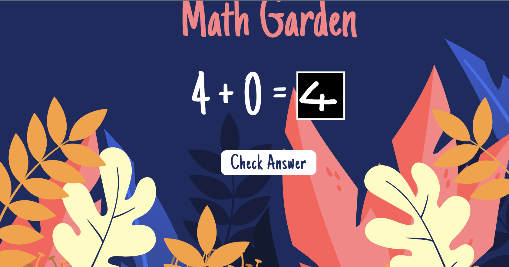

# brk-math-garden

Welcome to the Handwritten Digits Recognition Game! This project combines a handwritten digits recognition model with a fun and interactive game where users can enjoy practicing math operations and see flowers bloom in a virtual garden.

The handwritten digits recognition model was trained using **TensorFlow** and achieved an **accuracy** of 97.81%.

## How to Play
- Link for the [game](https://burakbdr.github.io/brk-math-garden/)
- Solve math operations presented on the screen using the handwritten digits recognition model.
- Correct answers make flowers bloom in the garden.
- Incorrect answers result in the removal of flowers from the garden.



## Customization

Feel free to customize the game by modifying the code. You can add new features, or update the UI.

## Installation

Clone the repository:

```bash
git clone https://github.com/your-username/handwritten-digits-game.git
cd handwritten-digits-game

